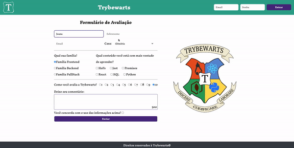

# Welcome to the Trybewarts Wizarding School project repository! 🧙

### README Translations:

-   [English](/README.en.md)
-   [Portuguese](/README.md)

* * *

## 👨‍💻 What was developed:

-   In this project, a Trybewarts School of Magic form page was developed, where student people can submit their feedback about it. The theme of this project is based on the work 'Harry Potter', by J.K. Rowling, since programming is the closest we can get to something**truly magical**!

:bulb:**See a sample below:**

# Mandatory Requirements

## 1. Create a green bar at the top of the page

  

A barra deve possuir a classe <code>header</code>, ser um <code>flex container</code> e ter a cor de fundo <code>rgb(50, 167, 145)</code>
  
 

-   Create an element that has the class equal to`header`;

-   Make the header one`flex container`;

-   Add to element with class`header`the background color`rgb(50, 167, 145)`;

    **What will be tested:**

-   There is an element with the class`header`;

-   The element has the CSS property`display: flex`;

-   The element has the CSS property`background-color: rgb(50, 167, 145)`.

## 2. Add the Trybewarts logo

  

    O logotipo deve estar dentro do <code>header</code> e ser um elemento <code>img</code>
  
 

-   create a tag`img`inside the element with the class`header`:

    -   add the class`trybewarts-header-logo`;
    -   add the attribute`src`with the value`images/trybewarts-header-logo.svg`;

    **What will be tested:**

-   There is an element`img`with the class`trybewarts-header-logo`;

-   The element has the attribute`src`pointing to`images/trybewarts-header-logo.svg`.

## 3. Add a login form to the`header`

  

    O formulário de login deve conter os inputs de <code>email</code>, <code>senha</code> e um botão de login e deve estar posicionado a direita da logo.
  
 

-   Create a form with the class`trybewarts-login`;
-   Create an input of**email**inside the form:
    -   add the attribute`name`with the value**email**;
    -   add the attribute`placeholder`with the value**Email**;
-   Create an input of**password**inside the form:
-   add the attribute`name`with the value**password**;
-   add the attribute`placeholder`with the value**Password**;
-   Create a button with the text**"Log in"**;
-   Make the form a**flex container**;
-   Make the form to the right of the logo;
-   Validate the form:
    -   By filling out the form and clicking the button, it will be validated that:
        -   If the email is**"[tryber@teste.com](mailto:tryber@teste.com)"**and the password is**"123456"**an alert will be issued containing the text**"Hello, Tryber!"**;
        -   In all other cases, an alert must be issued containing the text**"Invalid email or password."**;

**Keeping an eye on the tip 👀:**add property`flex`which makes the elements have the maximum spacing**between them**no**header**

**What will be tested:**

-   There is an element`form`with the class`trybewarts-login`;
-   There is an input with the attribute`name`equal to**email**it's the`placeholder`equal to**Email**;
-   There is an input with the attribute`name`equal to**password**it's the`placeholder`equal to**Password**;
-   There is a button with the text`Entrar`;
-   The form has the CSS property`display: flex`;
-   the element`form`is to the right of the logo;
-   Clicking the login button triggers a`alert`with the text`Email ou senha inválidos`, in case of data filling error;
-   Clicking the login button triggers a`alert`with the text`Olá, Tryber!`, in case of correct filling of the data.

## 4. Create a title with the text "Trybewarts" centered inside the`Header`

  

  

  Deve existir um elemento <code>h1</code> com o id <code>trybewarts-header-title</code> e com o texto <strong>"Trybewarts"</strong>
  
 

-   Crie a tag`h1`as`id`equal to`trybewarts-header-title`;
-   add the text**"Trybewarts"**inside`h1`;
-   The title should be in the middle of the green bar:
    -   The header must have exactly three child elements;
    -   The middle child must be the title;

**What will be tested:**

-   There is an element`h1`as`id`equal to`trybewarts-header-title`and with the text`Trybewarts`;
-   The element with the class`header`must have exact`3`child elements;
-   The middle child of the element with the class`header`must be the title`h1`with the text`Trybewarts`.

    

## 5. Add a form to the body of the page

  

  

  O formulário deve possuir o id <code>evaluation-form</code> e estar dentro de uma tag <code>main</code>
  
 

-   Create a form with`id`equal to`evaluation-form`;
-   Insert the form inside a tag`main`;
-   Make the form a`flex container`;
-   make the`main`, be one`flex containers`;
-   Add a width of`675px`to the form.

**What will be tested:**

-   There is an element`form`as`id`equal to`evaluation-form`;
-   the element`form`is inside the tag`main`;
-   the element`main`it's the`form`have the CSS property`display: flex`;
-   the element`form`has the CSS property`width: 675px`;

## 6. Make the form direction vertical

  

    A direção dos itens do formulário com o <code>id</code> igual a <code>evaluation-form</code> devem estar na vertical
 
 

-   Add to form with`id`equal to`evaluation-form`the property that changes the element's direction.

**What will be tested:**

-   the element`evaluation-form`has the CSS property`flex-direction: column`.

## 7. Add the Trybewarts logo to the right side of the page

  

  

  O elemento deve ser uma tag <code>img</code> com o <code>id</code> igual a <code>trybewarts-forms-logo</code>
  
 

-   create an element`img`as`id`equal to`trybewarts-forms-logo`;
-   add the attribute`src`with the value`images/trybewarts-colored.svg`;
-   add css style`height`of`500px`;

**What will be tested:**

-   There is an element`img`as`id`equal to`trybewarts-forms-logo`;
-   The element has the attribute`src`pointing to`images/trybewarts-colored.svg`;
-   The image has css style`height`equal to`500px`;

## 8. Add input from`nome, sobrenome`e`email`to the form

  

    Dentro do formulário com id <code>evaluation-form</code> adicione os inputs de <code>nome, sobrenome</code> e <code>email</code>
  
  

-   Create an input with the`id`equal to`input-name`:
    -   add the attribute`placeholder`with the value`Nome`;
-   Create an input with the`id`equal to`input-lastname`:
    -   add the attribute`placeholder`with the value`Sobrenome`;
-   Create an input with the`id`equal to`input-email`:
    -   add the attribute`placeholder`with the value`Email`.

**What will be tested:**

-   There is an input with the`id`equal to`input-name`e placeholder`Nome`;
-   There is an input with the`id`equal to`input-lastname`e placeholder`Sobrenome`;
-   There is an input with the`id`equal to`input-email`e placeholder`Email`.

## 9. Add a`select`to the form

  

    O formulário com <code>id</code> igual a <code>evaluation-form</code> deve possuir um input de <code>select</code> com as opções <code>Gitnória, Reactpuff, Corvinode</code> e <code>Pytherina</code>
  
  

-   create a`select`as`id`equal to`house`;
-   add to`select`:
    -   the option`Gitnória`as`id`equal to`gitnoria-house`and the attribute`value`equal to`Gitnória`;
    -   the option with`text`e`value`equal to`Reactpuff`It is like`id`equal to`reactpuff-house`;
    -   the option with`text`e`value`equal to`Corvinode`It is like`id`equal to`corvinode-house`;
    -   the option with`text`e`value`equal to`Pytherina`It is like`id`equal to`pytherina-house`.

**What will be tested:**

-   There is an element`select`com o id`house`;
-   There is an element`option`com`text`e`value`equal to`Gitnória`It is like`id`equal to`gitnoria-house`;
-   There is an element`option`com`text`e`value`equal to`Reactpuff`It is like`id`equal to`reactpuff-house`;
-   There is an element`option`com`text`e`value`equal to`Corvinode`It is like`id`equal to`corvinode-house`;
-   There is an element`option`com`text`e`value`equal to`Pytherina`It is like`id`equal to`pytherina-house`.

## 10. Position the fields of`Nome`e`Sobrenome`Side to side

  

    Os campos de <code>Nome</code> e <code>Sobrenome</code> devem estar lado a lado
  
  

-   Make the fields from`Nome`e`Sobrenome`stand side by side.

**What will be tested:**

-   the field of`Sobrenome`is to the right of the field`Nome`.

 

## 11. Position the fields of`Email`e`Casa`Side to side

  

    Os campos de <code>Email</code> e <code>Casa</code> devem estar lado a lado
  
  

-   Make the fields`Email`e`Casa`stand side by side.

**What will be tested:**

-   the field of`Casa`is to the right of the field`Email`.

## 12. Add 3 inputs of the type`radio`to the form

  

    O formulário deve possuir um campo de entrada com 3 inputs do tipo <code>radio</code> para que a pessoa estudante escolha qual família se identifica
  
  

-   create a`label`as`id`equal to`label-family`and add the text**"What's your family?"**;
-   Add the following elements to the form:
    -   a`input`of the type`radio`with the attribute`name`equal to`family`e`value`equal to`Frontend`;
    -   a`input`of the type`radio`with the attribute`name`equal to`family`e`value`equal to`Backend`;
    -   a`input`of the type`radio`with the attribute`name`equal to`family`e`value`equal to`FullStack`;
-   position the`radio buttons`to be below each other and in the sequence:**Frontend**,**Backend**e**FullStack**
-   Position the radio buttons below the`label`.

**What will be tested:**

-   There is an element`label`as`id`equal to`label-family`which has the text content`Qual sua família?`;
-   There is one`input`of the type`radio`with the attribute`name`equal to`family`e`value`equal to`Frontend`;
-   There is one`input`of the type`radio`with the attribute`name`equal to`family`e`value`equal to`Backend`;
-   There is one`input`of the type`radio`with the attribute`name`equal to`family`e`value`equal to`FullStack`;
-   The inputs of type`radio`are one below the other in the sequence`Frontend`,`Backend`e`FullStack`.
-   The inputs of type`radio`are below the text of`label`

## 13. Create inputs of the type`checkbox`

  

    Os campos de entrada do tipo <code>checkbox</code> devem conter seis opções: <code>Hofs, Jest, Promises, React, SQL, Python</code>
  
  

-   Create an element with`id`equal to`label-content`and add the text**"What content are you most eager to learn?"**;
-   Create an input like`checkbox`with the class`subject`it's the`value`equal to`HoFs`;
-   Create an input like`checkbox`with the class`subject`o`value`equal to`Jest`;
-   Create an input like`checkbox`with the class`subject`o`value`equal to`Promises`;
-   Create an input like`checkbox`with the class`subject`o`value`equal to`React`;
-   Create an input like`checkbox`with the class`subject`o`value`equal to`SQL`;
-   Create an input like`checkbox`with the class`subject`o`value`equal to`Python`;
-   Place the checkboxes below the label.

**What will be tested:**

-   There is an element`label`as`id`equal to`label-content`that has a text content`Qual conteúdo você está com mais vontade de aprender?`;
-   There is one`input`of the type`checkbox`with the class`subject`and the attribute`value`equal to`HoFs`;
-   There is one`input`of the type`checkbox`with the class`subject`and the attribute`value`equal to`Jest`;
-   There is one`input`of the type`checkbox`with the class`subject`and the attribute`value`equal to`Promises`;
-   There is one`input`of the type`checkbox`with the class`subject`and the attribute`value`equal to`React`;
-   There is one`input`of the type`checkbox`with the class`subject`and the attribute`value`equal to`SQL`;
-   There is one`input`of the type`checkbox`with the class`subject`and the attribute`value`equal to`Python`;
-   The elements`checkbox`then positioned below the label.

## 14. Create an evaluation field

  

    O campo deve possuir 10 inputs do tipo <code>radio</code> para avaliar de 1 a 10 o nível de satisfação com a Trybewarts
  
  

-   create a`label`as`id`equal to`label-rate`and add the text**"How do you rate Trybewarts?"**;
-   create 10`radio buttons`, containing options 1 to 10:
    -   add the attribute`value`with the value from 1 to 10;
-   add to attribute`name`From`radios buttons`the value`rate`;
-   position the`radio buttons`to stand side by side.

**What will be tested:**

-   There is an element`label`as`id`equal to`label-rate`that has a text content`Como você avalia a Trybewarts?`;
-   There are 10`radio-buttons`with the attribute`name="rate"`;
-   There are 10`radio-buttons`containing the attribute`value`from 1 to 10.

  

## 15. Create a textarea

  

    O número máximo de caracteres da <code>textarea</code> deve ser igual à 500
  
  

-   create a`textarea`;
-   Create a label with the class`textarea`and that it has the text**"Leave your comment:"**;
-   add to element`textarea`the 500 character limit.

**What will be tested:**

-   There is one`label`with the class`textarea`and the text`Deixe seu comentário:`;
-   the element`textarea`has a limit of 500 characters.

## 16. Validate form information

  

     Adicione um campo de entrada do tipo <code>checkbox</code> que deve validar a permissão de uso das informações
  
   

-   Create an input field of type`checkbox`as`id`equal to`agreement`;
-   Create a label with the`id`equal to`label-infos`and that it has the text**"Do you consent to the use of the above information?"**;
-   position the`checkbox`next to the label.

**What will be tested:**

-   There is a label with the`id`equal to`label-infos`which has the text`Você concorda com o uso das informações acima?`;
-   There is an input of the type`checkbox`as`id`equal to`agreement`;

 

## 17. Create a "Submit" button to submit the form

  

    O botão para submeter o formulário deve ser do tipo <code>submit</code> e possuir o <code>id</code> igual a <code>submit-btn</code>
  
  

-   Create a button like`submit`as`id`equal to`submit-btn`;
-   add the text**"Submit"**to the button.

**What will be tested:**

-   There is a button like`submit`com o id`submit-btn`and the text`Enviar`;

  

## 18. Enable the "Send" button after validation of the`checkbox`

  

    O botão deve ser habilitado somente se o <code>checkbox</code> com o <code>id</code> igual a <code>agreement</code> estiver selecionado
  
  

-   Disable the button if the`checkbox`is not selected;
-   Enable the button if the`checkbox`be selected.

**What will be tested:**

-   The button is initially disabled;
-   The button becomes enabled by marking the field with`id`equal to`agreement`;

  

## 19. Create a footer at the bottom of the page

  

    O rodapé deverá conter o texto <strong>"Direitos reservados à Trybewarts©"</strong>
  
  

-   Create a footer with the text**"Rights reserved to Trybewarts©"**.

**What will be tested:**

-   There is an element`footer`must have the text`Direitos reservados à Trybewarts©`.

  

* * *

# Bonus Requirements

## 20. Create a character counter

  

    O contador deve possuir o <code>id</code> igual a <code>counter</code> contendo o número de caracteres, que deverá ser atualizado a medida que algo for digitado na <code>textarea</code>
  
  

-   Create the counter and add the`id`equal to`counter`;
-   Add to the counter the initial value of`500`:
    -   The counter must vary between`500`characters and`0`;
-   Decrement the counter as something is written in the field`textarea`;
-   Increment the counter as something is deleted in the field`textarea`;
-   add to element`textarea`o`id`equal to`textarea`.

**What will be tested:**

-   There is an element with the id`counter`;
-   There is an element with the id`textarea`;
-   Filling in the field`textarea`changes the number displayed in the element`#counter`;

## 21. Replace the form with the student person information

  

    Faça com que, ao clicar no botão <code>Enviar</code>, o conteúdo dentro da tag <code>form</code> seja substituído pelas informações preenchidas pela pessoa estudante
  
  

-   Create an element with`id`equal to`form-data`and inside it:
    -   Create a field that will receive the name typed by the user, in the format`Nome: Alguem Aqui`;
    -   Create a field that will receive the email typed by the user, in the format`Email: email@mail.com`;
    -   Create a field that will receive the house chosen by the user, in the format`Casa: Casa Escolhida`;
    -   Create a field that will receive the family selected by the user, in the format`Família: Família Escolhida`;
    -   Create a field that will receive the contents selected by the user, in the format`Matérias: Matérias, Marcadas, Aqui`;
        > **Keeping an eye on the tip 👀:**the contents must be separated by a comma and a space
    -   Create a field that will receive the evaluation selected by the user, in the format`Avaliação: NotaAqui`;
    -   Create a field that will receive the comment typed by the user, in the format`Observações: Observações aqui`.
    -   Replace the fields in the form fields with the user's information;

**What will be tested:**

-   the element`<form>`com`id`equal to`form-data`should be displayed on the screen;
-   When clicking the send button, there is a text in the format`Nome: -Nome- -Sobrenome-`;
-   When clicking the send button, there is a text in the format`Email: -Email-`;
-   When clicking the send button, there is a text in the format`Casa: -Casa-`;
-   When clicking the send button, there is a text in the format`Família: -Família-`;
-   When clicking the send button, there is a text in the format`Matérias: -Matérias Selecionadas-`;
-   When clicking the send button, there is a text in the format`Avaliação: -Avaliação-`;
-   When clicking the send button, there is a text in the format`Observações: -Observações-`;
-   When submitting the information, the form must be replaced by the user's information.

